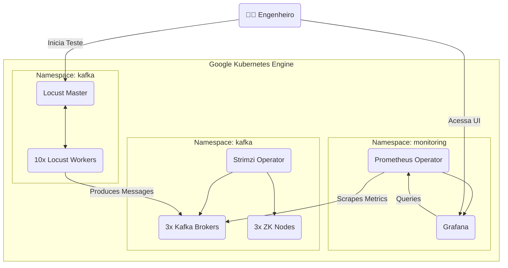
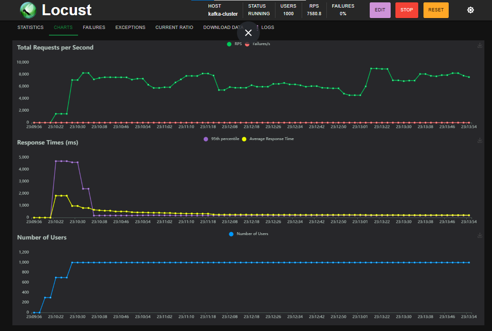
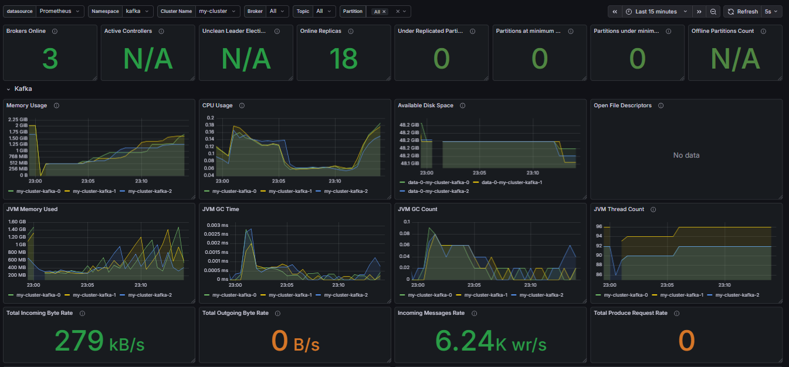
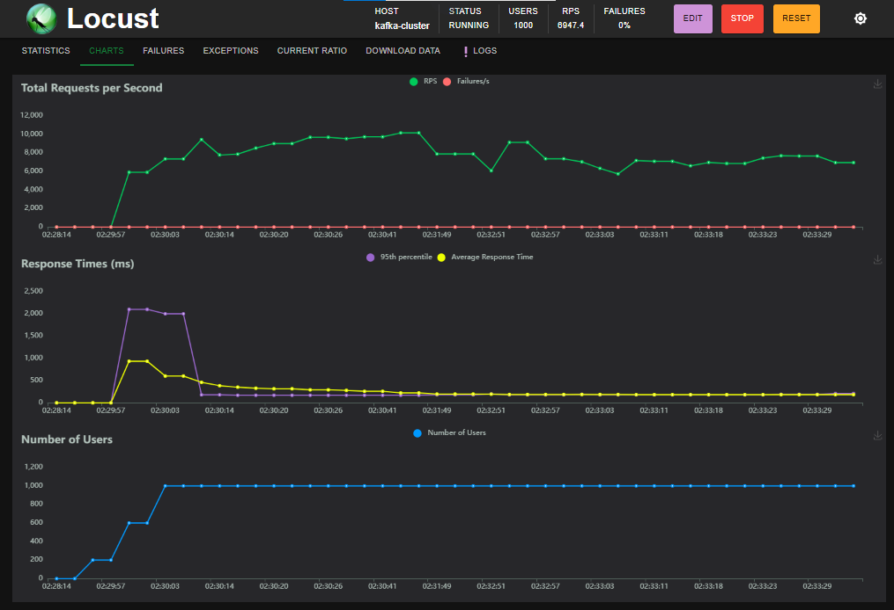
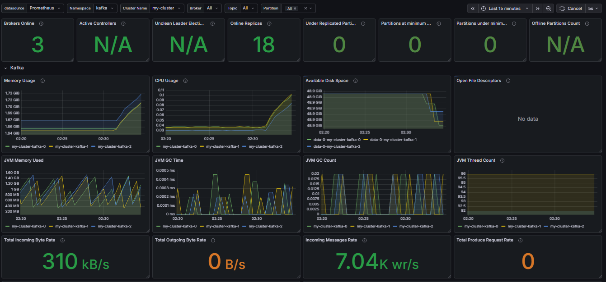
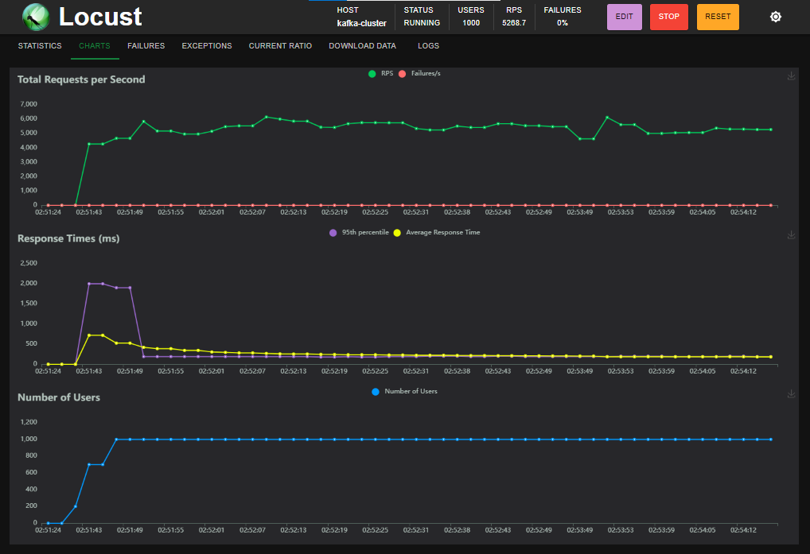

#  Kafka Performance Benchmark Lab on GKE


Este projeto implementa um laboratório completo de Engenharia de Dados para realizar testes de carga (*stress testing*) em um cluster Apache Kafka de alta disponibilidade, orquestrado pelo Strimzi no Google Kubernetes Engine (GKE).

O objetivo é ir além da simples implantação, focando em **medir, analisar e otimizar** o *throughput* (vazão) e a latência sob diferentes configurações de produtor, utilizando testes de carga distribuídos com Locust.

## 🏛️ Arquitetura

O ambiente é composto por um ecossistema de ferramentas padrão de mercado, integradas para fornecer uma plataforma robusta de teste e observabilidade.



## ✨ Features

- **Infraestrutura como Código:** Setup do cluster GKE automatizado via script.
- **Gerenciamento Declarativo:** Cluster Kafka e Zookeeper gerenciados pelo Strimzi Operator.
- **Observabilidade Completa:** Métricas JMX do Kafka expostas para Prometheus e visualizadas em dashboards Grafana customizados.
- **Teste de Carga Distribuído:** Swarm de Locust rodando dentro do Kubernetes para gerar alta carga sem gargalos de rede externa.
- **Análise de Performance:** Metodologia de teste para avaliar o trade-off entre Vazão (Throughput), Latência e Durabilidade.

## ⚙️ Tech Stack

- **Cloud/Containerização:** Google Cloud Platform (GCP), GKE, Docker.
- **Orquestração:** Kubernetes, Helm.
- **Apache Kafka:** Strimzi Operator, Kafka Brokers, Zookeeper.
- **Teste de Carga:** Locust, Python, Confluent Kafka Client.
- **Monitoramento:** Prometheus Operator, Grafana.

## 🚀 Guia de Setup e Execução

Siga os passos abaixo para recriar o ambiente de benchmark.

### Pré-requisitos
- `gcloud` CLI autenticado
- `kubectl`
- `helm`
- `docker`

### 1. Provisionar a Infraestrutura
O script `setup-infra.sh` cria o cluster GKE com nós otimizados e um StorageClass SSD.
```bash
chmod +x setup-infra.sh
./setup-infra.sh
```

### 2. Instalar Operadores
Instalamos os operadores Strimzi (para o Kafka) e Prometheus (para monitoramento).
```bash
# Strimzi Operator
kubectl create namespace kafka
helm repo add strimzi https://strimzi.io/charts/
helm install strimzi-operator strimzi/strimzi-kafka-operator -n kafka --version 0.40.0

# Prometheus & Grafana
kubectl create namespace monitoring
helm repo add prometheus-community https://prometheus-community.github.io/helm-charts
helm install prometheus prometheus-community/kube-prometheus-stack -n monitoring
```

### 3. Implantar o Cluster Kafka e a Observabilidade
Aplicamos os manifestos para criar o cluster Kafka, o usuário, o tópico e o `PodMonitor` que conecta o Kafka ao Prometheus.
```bash
kubectl apply -f k8s/metrics/kafka-metrics.yaml
kubectl apply -f k8s/kafka-cluster.yaml
kubectl apply -f k8s/kafka-topic.yaml
kubectl apply -f k8s/kafka-user.yaml
kubectl apply -f k8s/pod-monitor.yaml
```

### 4. Preparar e Implantar o Locust Swarm
Construímos uma imagem Docker customizada para o Locust com as dependências necessárias e a implantamos no cluster.

```bash
# 1. Construir e enviar a imagem Docker customizada
# (Substitua <seu-usuario-dockerhub> pelo seu usuário)
docker build -t <seu-usuario-dockerhub>/kafka-locust:1.0 .
docker push <seu-usuario-dockerhub>/kafka-locust:1.0

# 2. Atualize a imagem no arquivo k8s/locust-swarm.yaml

# 3. Crie os segredos e implante o Locust
kubectl create configmap locust-script -n kafka --from-file=src/locustfile.py
kubectl create secret generic kafka-locust-secret -n kafka --from-literal=password='<SUA_SENHA_KAFKA>'
kubectl apply -f k8s/locust-swarm.yaml

# 4. Obtenha o IP para acessar a UI do Locust
kubectl get svc locust-master-svc -n kafka
```

## 📊 Relatório Benchmark de Performance

## Resumo Executivo

Este relatório detalha o benchmark de performance de um cluster Apache Kafka no GKE, visando otimizar a configuração do produtor Python para diferentes cargas de trabalho. A configuração de **Baseline** (`batch.size=64KB`, `linger.ms=10`) estabeleceu uma base sólida com vazão de **~7.500 msg/s** e latência média estável.

A otimização para **Alta Vazão** (`batch.size=128KB`) foi a mais eficiente: elevou o throughput para picos de **~10.000 msg/s** (+30%) enquanto **reduziu drasticamente o uso de CPU** nos brokers (de 18% para 5%), tornando-a ideal para ingestão de dados em massa com baixo custo.

Por outro lado, o teste de **Baixa Latência** (`linger.ms=0`) revelou-se contraproducente para alto volume: a tentativa de envio imediato congestionou a rede, **triplicando a latência** e elevando o consumo de CPU, provando que o *batching* é indispensável para a estabilidade do sistema.

---

### Análise Detalhada por Cenário

Para validar a capacidade e o comportamento do cluster sob diferentes requisitos de negócio, executamos 4 cenários de testes distintos variando as configurações do **Producer (Locust)**.

### Cenário 1: Baseline (Configuração Balanceada)
* **Configuração:** `batch.size=64KB`, `linger.ms=10`, `acks=1`, `compression=lz4`.
* **Objetivo:** Estabelecer um ponto de partida com foco em equilíbrio entre latência e vazão.

| Locust Charts | Grafana Dashboard |
| :---: | :---: |
|  |  |

**Resultados:**
* **Throughput:** Atingimos uma vazão consistente de **~7.500 mensagens/segundo (RPS)** sem erros de entrega.
* **Latência:** Após o *ramp-up* inicial, a latência média se manteve estável em **~200ms**.
* **Eficiência:** O uso de CPU nos brokers ficou em torno de **15% a 18%** (0.15 vCPU), indicando folga para escalar. O uso de compressão **LZ4** manteve a entrada de rede baixa (~279 kB/s), otimizando custos.

---

### Cenário 2: High Throughput (Lotes Maiores)
* **Configuração:** `batch.size=128KB` (Dobrado), `linger.ms=10`.
* **Hipótese:** Aumentar o tamanho do lote reduzirá o overhead de I/O e CPU, permitindo maior vazão.

| Locust Charts | Grafana Dashboard |
| :---: | :---: |
|  |  |

**Resultados:**
* **Throughput:** Atingimos uma vazão consistente de **~7.500 mensagens/segundo (RPS)** sem erros de entrega.
* **Latência:** Após o *ramp-up* inicial, a latência média se manteve estável em **~200ms**.
* **Eficiência:** O uso de CPU nos brokers ficou em torno de **15% a 18%** (0.15 vCPU), indicando folga para escalar. O uso de compressão **LZ4** manteve a entrada de rede baixa (~279 kB/s), otimizando custos.

---

### Cenário 3: Low Latency (Envio Imediato)
* **Configuração:** `linger.ms=0` (Sem espera), `batch.size=64KB`.
* **Hipótese:** Remover o tempo de espera entregará mensagens mais rápido.
  
| Locust Charts | Grafana Dashboard |
| :---: | :---: |
|  |  |

**Resultados (Degradação):**
* **Latência:** Ao contrário do esperado, a latência média **triplicou para ~600ms**. O envio de pacotes minúsculos congestionou a rede e a fila de processamento.
* **Custo de CPU:** O uso de CPU saltou para **~35%** (aumento de 7x comparado ao Cenário 2), pois os brokers tiveram que processar milhares de requests individuais.
* **Conclusão:** `linger.ms=0` é contraindicado para streaming de alto volume. O *batching* (mesmo que pequeno, 5-10ms) é essencial para estabilidade do cluster.
  
---

### Cenário 4: Max Durability (Segurança Total)
* **Configuração:** `acks=all` (Confirmação de todas as réplicas).
* **Hipótese:** Garantir persistência em todas as réplicas evitará perda de dados, mas custará performance.

| Locust Charts | Grafana Dashboard |
| :---: | :---: |
|  |  |

**Resultados:**
* **Impacto na Vazão:** O throughput caiu cerca de **30%** em relação ao Baseline (de 7.5k para **~5.400 RPS**), um "imposto" aceitável para garantir durabilidade zero-loss.
* **Custo Computacional:** O uso de CPU disparou para **~90% de 1 vCPU** (quase saturação), indicando que a replicação síncrona é intensiva para o processador.
* **Conclusão:** Use `acks=all` apenas para dados críticos (transações financeiras). Para logs ou métricas, o custo extra de hardware pode não se justificar.

---

### Tabela Comparativa

| Cenário | Configuração | RPS Médio | Latência Média | Uso de CPU (Broker) | Veredito |
| :--- | :--- | :--- | :--- | :--- | :--- |
| **1. Baseline** | Batch 64KB / Acks 1 | ~7.500 | ~200ms | 15% | ✅ Equilibrado |
| **2. Throughput** | Batch 128KB | ~7.000 (Pico 10k) | ~170ms | **5% (Melhor)** | 🚀 Mais Eficiente |
| **3. Latency** | Linger 0ms | ~4.700 | ~600ms | 35% | ❌ Instável |
| **4. Durability** | Acks All | ~5.400 | ~200ms | **90% (Pior)** | 🛡️ Mais Seguro |

### Conclusão Final e Recomendações

* **Trade-off Central:** Os testes validaram o trade-off clássico de sistemas distribuídos: o agrupamento de dados (*batching*) maximiza a vazão e eficiência, enquanto o envio imediato sobrecarrega a infraestrutura. O equilíbrio ideal depende estritamente do SLA da aplicação.

* **Recomendação Principal (Data Engineering):** Para a ingestão massiva de logs, métricas e Data Lakes, a configuração de **Alta Vazão (Cenário 2)** é a vencedora indiscutível. Ela entregou o maior throughput (~10k RPS de pico) com apenas ~5% de uso de CPU, provando ser a arquitetura mais sustentável e econômica (Green IT).

* **Recomendações Secundárias:**
    * **Sistemas Críticos:** Para fluxos financeiros ou de auditoria, a configuração de **Durabilidade (Cenário 4)** com `acks=all` é mandatória, aceitando-se o custo de ~30% na vazão e maior uso de CPU.
    * **Latência Sensível:** O teste demonstrou que remover totalmente o buffer (`linger.ms=0`) é contraproducente em alta carga, pois gerou congestionamento. Para baixa latência, recomenda-se manter um **batching mínimo** (ex: `linger.ms=5`) em vez de zero, para garantir fluxo contínuo sem engargalar a rede.

## 🧹 Limpeza do Ambiente (Teardown)

Para evitar cobranças indesejadas no Google Cloud (GCP), é obrigatório destruir o cluster e os discos persistentes que o Kafka utilizou.

Execute os comandos abaixo na ordem:

```bash
# 1. Deletar o Cluster Kubernetes
# (Isso para a cobrança das máquinas virtuais/nós)
gcloud container clusters delete kafka-bench --zone us-central1-a --quiet

# 2. Deletar Discos SSD Órfãos (CRÍTICO)
# (O GKE não deleta os discos de dados automaticamente. Se pular isso, você será cobrado pelo armazenamento)
gcloud compute disks list --filter="name~^gke" --zones us-central1-a --format="value(name)" | xargs -I {} gcloud compute disks delete {} --zone us-central1-a --quiet
```

## 📄 Licença
Este projeto está sob a licença MIT. Veja o arquivo `LICENSE` para mais detalhes.
